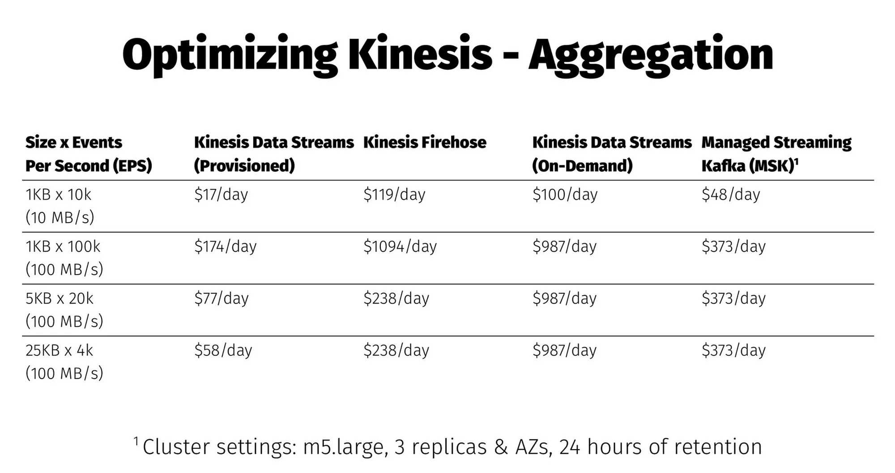

<meta property="og:title" content="Reduce AWS Kinesis Costs by 80% with this One Weird Trick" />
<meta property="og:image" content={https://media.wnyc.org/i/800/0/c/85/1/twinpeaks.jpg} />

# Reduce AWS Kinesis Costs by 80% with this One Weird Trick

## The Trick
Aggregate multiple records into a single aggregated record. That’s it.

## Why It Works
The [AWS Kinesis Data Streams service bills based on two criteria](https://aws.amazon.com/kinesis/data-streams/pricing/): the number of shards running per hour (“shard hours”) and the amount of bytes per record put into each stream. Each shard has a maximum capacity (either 1,000 records written per second or 1 MB written per second) and while there are potential savings in managing shard hours, the greater cost savings is in managing record sizes.

That’s because records are billed in increments of 25 KB, which means you pay the same amount if the record is 500 bytes, 5 KB, or 25 KB. Do you see where this is going? If you aggregate many records into a single record, with the goal of getting as close to 25 KB as possible, then you can save up to 80% on all costs (assuming 1,000 bytes per original record and 25 KB per aggregated record).

The table below (taken from [my presentation at 2023's fwd:cloudsec conference](../presentations/2023_fwdcloudsec_billions_served_processing_security_event_logs_with_the_aws_serverless_stack.pdf)) shows the cost comparison across multiple AWS streaming services and how record size can have a big impact on savings:

## How to Do It
In short, your application needs to support record aggregation and de-aggregation. Both are built into and native features of [Substation](https://github.com/brexhq/substation), so if you use that, then you immediately get the advantage of this cost savings. If you want to build your own solution, then you could add support for the [Kinesis Producer Library](https://docs.aws.amazon.com/streams/latest/dev/developing-producers-with-kpl.html) or otherwise use any other method of aggregation (JSON array, protobuf, text compression, etc).

### Wait, What About Kinesis Firehose?

The [Kinesis Firehose service bills based on several criteria](https://aws.amazon.com/firehose/pricing/) (many of them optional), but the primary driver of cost is the amount of data ingested. Similar to Data Streams, it bills in increments, but each increment is 5 KB instead of 25 KB so the savings are not as significant. The effective cost per record is much higher than Data Streams as well which leads to a 5x to 10x increase in base costs.

### But the API Supports Record Batching?!

Both services have APIs that support batching records ([Data Streams](https://docs.aws.amazon.com/kinesis/latest/APIReference/API_PutRecords.html), [Firehose](https://docs.aws.amazon.com/firehose/latest/APIReference/API_PutRecordBatch.html)), but these [_do not affect cost_](https://aws.amazon.com/firehose/faqs/#Pricing_and_billing):
> Q: When I use PutRecordBatch operation to send data to Amazon Data Firehose, how is the 5KB roundup calculated?
> 
> The 5KB roundup is calculated at the record level rather than the API operation level. For example, if your PutRecordBatch call contains two 1KB records, the data volume from that call is metered as 10KB. (5KB per record)

Use these APIs to reduce the amount of network calls, not save money.
